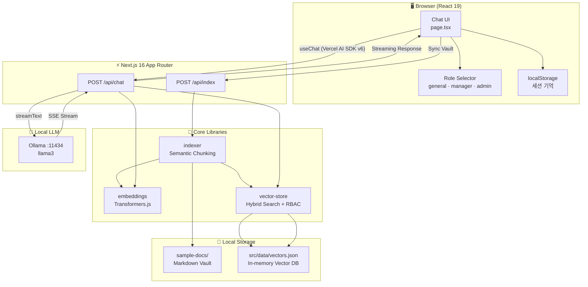
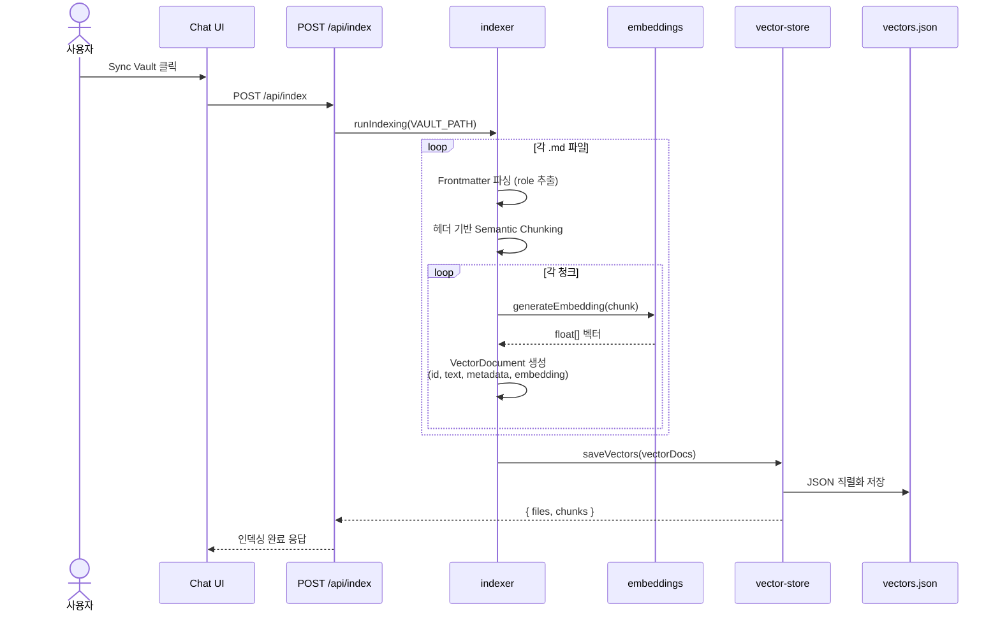
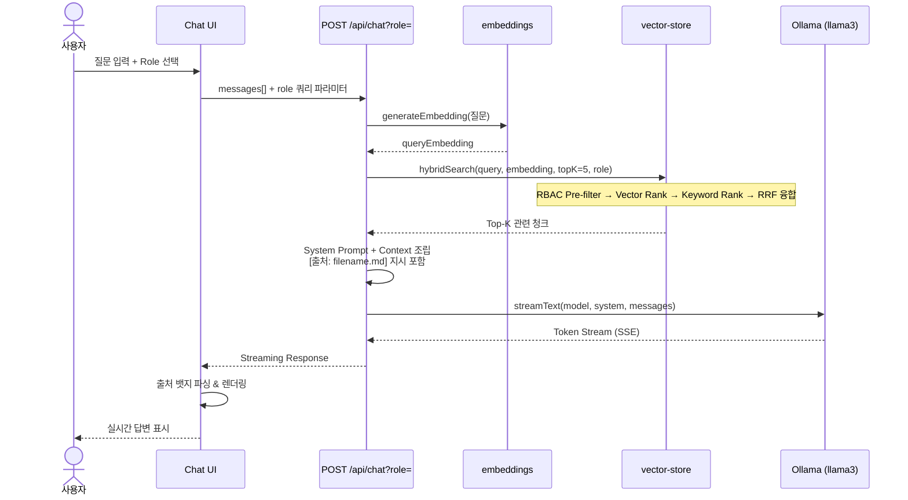
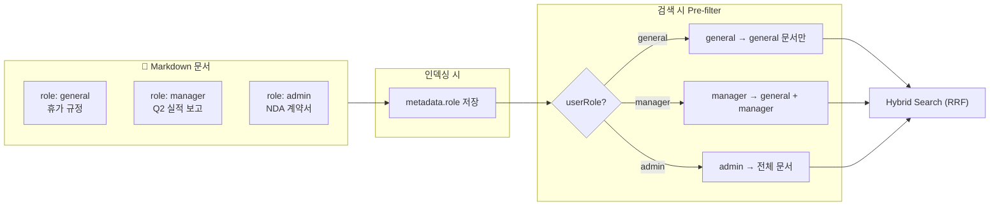
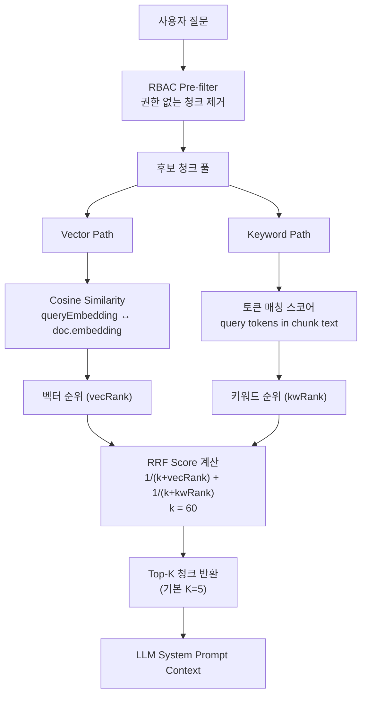
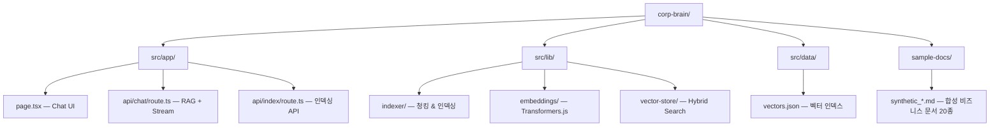
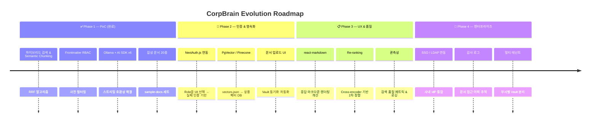

# CorpBrain

엔터프라이즈급 권한 관리(RBAC)를 지원하는 **로컬 RAG(Retrieval-Augmented Generation) 기반 사내 문서 챗봇 시스템**입니다.

## ✨ 주요 기능

- **하이브리드 검색 (Hybrid Search)**: 벡터 유사도 기반의 의미론적 검색(Semantic Search)과 키워드(BM25) 검색을 융합하여 RRF 알고리즘으로 정확도 극대화
- **시맨틱 청킹 (Semantic Chunking)**: 단순 글자 수 단위가 아닌 마크다운 헤더(`#`, `##`) 단위로 텍스트를 청킹하여 문맥 보존
- **권한 관리 (RBAC - Role-Based Access Control)**: 
  - 각 문서의 Frontmatter(`role: admin | manager | general`)를 기반으로 열람 권한 차등 적용
  - 사용자의 권한 등급을 파악하여 **허가되지 않은 문서는 검색 및 참조 단계에서 원천 차단 (Pre-filtering)**
- **100% 로컬 프라이버시 유지**: `Ollama` 및 로컬 임베딩 모델(Transformers.js)을 사용하여 사내 기밀 문서를 외부 클라우드로 전송하지 않음
- **세션 기억 기능**: 브라우저 스토리지를 활용한 대화 내용 저장
- **출처 명시**: AI 답변 시 참고한 사내 문서의 정확한 파일명(출처 뱃지) 표기

---

## 🏗️ 시스템 아키텍처



| 레이어 | 기술 | 역할 |
|--------|------|------|
| **Presentation** | Next.js, React 19, TailwindCSS 4 | 채팅 UI, 권한 선택, 출처 뱃지 렌더링 |
| **API** | Next.js Route Handlers, Vercel AI SDK v6 | 스트리밍 채팅, 문서 인덱싱 트리거 |
| **RAG Pipeline** | Indexer, Embeddings, Vector Store | 청킹 → 임베딩 → 검색 → 컨텍스트 조립 |
| **Inference** | Ollama (llama3), Transformers.js | LLM 생성, 로컬 임베딩 (`Xenova/all-MiniLM-L6-v2`) |
| **Data** | Markdown Vault, `vectors.json` | 원본 문서, 벡터 인덱스 (현재 파일 기반) |

---

## 📥 문서 인덱싱 플로우 (Sync Vault)

`Sync Vault` 버튼을 누르면 `/sample-docs` 내 마크다운 문서가 벡터 인덱스로 변환됩니다.



---

## 💬 채팅 / RAG 질의 플로우

사용자 질문이 들어오면 **임베딩 → 하이브리드 검색 → 프롬프트 조립 → Ollama 스트리밍** 순으로 처리됩니다.



---

## 🔐 RBAC 권한 필터링

문서별 `role` Frontmatter와 사용자 Role이 **검색 단계에서 사전 필터링**됩니다.



| 사용자 Role | 열람 가능 문서 |
|-------------|----------------|
| `general` | `role: general` |
| `manager` | `role: general`, `role: manager` |
| `admin` | 모든 문서 |

---

## 🔍 하이브리드 검색 (RRF) 알고리즘

의미론적 검색과 키워드 검색의 순위를 **Reciprocal Rank Fusion(RRF)** 으로 융합합니다.



---

## 📂 프로젝트 구조



| 경로 | 설명 |
|------|------|
| `/src/app` | Next.js 앱 라우터 페이지 및 API 연동 |
| `/src/lib/vector-store` | 하이브리드 검색 및 벡터 스토리지 (`vectors.json`) |
| `/src/lib/indexer` | 마크다운 Semantic Chunking 및 임베딩 생성 |
| `/src/lib/embeddings` | Transformers.js 기반 텍스트 벡터 변환 |
| `/sample-docs` | 사내 규정, 인보이스, 계약서, 기안서 등 샘플 데이터 |

---

## 🛠️ 기술 스택

- **Frontend**: Next.js 16 (App Router), React 19, TailwindCSS 4, Lucide-React
- **Backend**: Next.js API Routes, Vercel AI SDK (v6), `@ai-sdk/openai`
- **LLM Engine**: Ollama (로컬 오픈소스 모델 구동)
- **Embedding**: `@xenova/transformers` (In-browser/Node.js 로컬 임베딩)

---

## 🚀 실행 방법

### 1. 사전 준비 (Prerequisites)
- [Node.js](https://nodejs.org/) (v18 이상 권장)
- [Ollama](https://ollama.com/) 설치 및 실행
  ```bash
  # Llama 3 모델 다운로드 및 실행
  ollama run llama3
  ```

### 2. 설치 및 실행 (Installation)
```bash
# 1. 레포지토리 클론
git clone https://github.com/dayainow/corp-brain.git
cd corp-brain

# 2. 의존성 설치
npm install

# 3. 개발 서버 실행
npm run dev
```

### 3. 테스트 방법
1. 브라우저에서 `http://localhost:3000`에 접속합니다.
2. 우측 상단의 `Sync Vault` 버튼을 눌러 `/sample-docs` 폴더 내의 더미 마크다운 문서들을 인덱싱합니다.
3. 문서의 `role` 속성에 따라 `General`, `Manager`, `Admin` 권한을 선택하며 RAG가 권한에 맞게 답변하는지 테스트할 수 있습니다.

---

## 🗺️ 로드맵 (고도화 계획)



| 우선순위 | 과제 | 현재 상태 | 목표 |
|----------|------|-----------|------|
| 🔴 High | NextAuth.js 연동 | UI 드롭다운 Role 선택 | JWT/세션 기반 실제 RBAC |
| 🔴 High | PgVector 도입 | `vectors.json` 파일 저장 | 영구 벡터 DB, 대용량 지원 |
| 🟡 Medium | 문서 업로드 UI | `sample-docs` 고정 경로 | 드래그앤드롭 업로드 & 재인덱싱 |
| 🟡 Medium | react-markdown | 커스텀 출처 파싱 | 표·코드블록 등 풍부한 렌더링 |
| 🟢 Low | Re-ranking | RRF 단일 단계 | Cross-encoder 2차 정렬 |
| 🟢 Low | SSO / 감사 로그 | 없음 | 엔터프라이즈 보안 요건 충족 |

---

## 📄 라이선스 & 기여

이 프로젝트는 지속적으로 고도화 중입니다. 이슈와 PR은 [dayainow/corp-brain](https://github.com/dayainow/corp-brain)에서 환영합니다.
