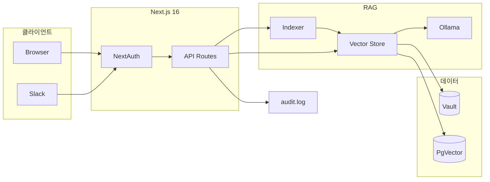
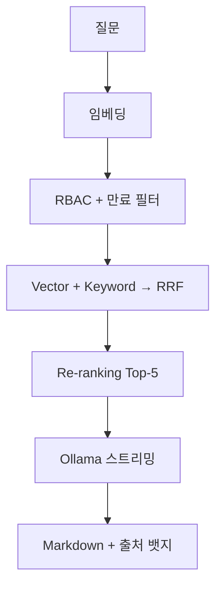

# CorpBrain

**NovaPay(노바페이)** 사내 지식 베이스를 위한 엔터프라이즈급 **로컬 RAG 챗봇**입니다.  
사내 문서를 Ollama로 로컬 처리하며, RBAC·NextAuth·Slack 연동까지 지원합니다.

> 타깃: 주식회사 노바페이 — B2B 결제·정산 FinTech (320명)  
> 상세 계획·설계 다이어gram: [`docs/UPGRADE_PLAN.md`](docs/UPGRADE_PLAN.md)

---

## 한눈에 보기

| 항목 | 내용 |
|------|------|
| **목적** | 사내 마크다운·PDF·DOCX 문서를 검색해 권한에 맞게 AI 답변 |
| **LLM** | Ollama `llama3` (로컬, API 키 불필요) |
| **임베딩** | `Xenova/all-MiniLM-L6-v2` (384차원, Transformers.js) |
| **벡터 DB** | `vectors.json` (개발) / PostgreSQL + PgVector (운영) |
| **인증** | NextAuth v5 — Credentials + Google SSO |
| **샘플 데이터** | `sample-docs/` 합성 비즈니스 문서 22종 |

---

## 주요 기능

| 영역 | 기능 |
|------|------|
| **검색** | Vector + Keyword 하이brid → RRF(`k=60`) → Re-ranking → Top-5 |
| **청킹** | MD: 헤더 기반 Semantic / PDF·DOCX: 1000자 단위 분할 |
| **권한** | Frontmatter `role` + NextAuth 세션, 검색 단계 Pre-filtering |
| **인증** | bcrypt 데모 계정 5종 + Google Workspace (`@novapay.kr`) |
| **문서** | `.md` `.pdf` `.docx` 업로드 (5MB), 증분 인덱싱 |
| **만료** | `expires: YYYY-MM-DD` — 만료 문서 검색·인용 제외 |
| **UI** | react-markdown + GFM, 출처 뱃지, localStorage 세션 기억 |
| **Admin** | 감사 로그, 문서·청크 통계, Hit@3/MRR 메트릭 |
| **보안** | Middleware, Rate limit (20/min), 감사 로그, SIEM Webhook |
| **연동** | Slack `/corpbrain`, Docker Compose, GitHub Actions CI |

---

## 시스템 아키텍처

브라우저·Slack 요청 → NextAuth 인증 → API → RAG 검색 → Ollama 스트리밍. 벡터는 JSON 또는 PgVector.



| 레이어 | 기술 |
|--------|------|
| Frontend | React 19, TailwindCSS 4, react-markdown, remark-gfm |
| Auth | NextAuth v5, Middleware, bcryptjs |
| AI | Vercel AI SDK v6, `@ai-sdk/react`, Ollama OpenAI 호환 API |
| Embedding | `@xenova/transformers` |
| Parsing | pdf-parse v2, mammoth |
| Storage | JsonVectorStore / PgVectorStore (interface 추상화) |
| Ops | audit.log, SIEM, Playwright, Vitest, Docker |

---

## RAG 검색 파이프라인



1. **후보 수집** — Cosine Similarity + 토큰 매칭 각각 순위 → RRF로 Top-20
2. **Re-ranking** — 파일명·제목·구문 매칭 가산 (`src/lib/search/reranker.ts`)
3. **생성** — Top-5를 System Prompt에 주입, `[출처: filename.md]` 인용 강제
4. **품질 측정** — `data/eval-queries.json` 8문항, `npm run eval:search` 또는 Admin `/api/admin/metrics`

---

## 웹 UI

### 채팅 (`/`)

- NextAuth 세션 기반 — Role은 **로그인 계정에서 자동** (UI 드롭다운 없음)
- Vercel AI SDK v6 `DefaultChatTransport` 스트리밍
- Assistant 응답: **react-markdown + GFM** (표·코드블록 지원)
- `[출처: ...]` 패턴 → 클릭 가능한 **출처 뱃지**로 렌더링
- `localStorage`에 대화 저장·복원, Clear 버튼으로 초기화
- **Manager+**: Upload 모달 (`.md` `.pdf` `.docx`, role 지정)
- **Admin**: Sync Vault(전체 재인덱싱), Admin 대시보드 링크

### 로그인 (`/login`)

- Credentials: `@novapay.kr` 데모 계정
- Google Workspace SSO (`.env`에 `GOOGLE_CLIENT_ID` 설정 시 버튼 표시)
- 데모 계정 원클릭 입력 UI

### Admin 대시보드 (`/admin`)

Admin 전용. 다음을 한 화면에서 조회합니다.

| 패널 | 내용 |
|------|------|
| **통계 카드** | 문서 수, 청크 수, Admin 문서 수, 감사 로그 건수 |
| **검색 품질** | Hit@1, Hit@3 (목표 80%), MRR |
| **감사 로그** | chat.query, document.upload, index.sync 등 최근 50건 |
| **문서 목록** | 파일명, title, role, md/pdf/docx 타입별 badge |

---

## 인증 & RBAC

- **Middleware** (`src/middleware.ts`): `/login`·`/api/auth`·`/api/health`·`/api/slack` 제외 전 경로 보호
- **API Guard** (`requireAuth(minimumRole?)`): chat, upload, index, admin API
- **Google SSO**: `hd=novapay.kr`, 도메인 외 계정 거부, `role-mapping.ts`로 Role 결정
- **부서 키워드 매핑** (SSO 신규 사용자): 법무/컴플라이언스 → admin, 재무/인사 → manager, 그 외 → general

| Role | 열람 문서 | 업로드 | Sync Vault | Admin |
|------|-----------|--------|------------|-------|
| `general` | general | — | — | — |
| `manager` | general + manager | O | — | — |
| `admin` | 전체 | O | O | O |

### 데모 계정 (비밀번호 공통: `novapay2026`)

| 이름 | 이메일 | 부서 | Role |
|------|--------|------|------|
| 김준호 | kim.junho@novapay.kr | 엔지니어링 | general |
| 정해인 | jung.haein@novapay.kr | 고객지원 | general |
| 박수연 | park.suyeon@novapay.kr | 재무회계 | manager |
| 최유나 | choi.yuna@novapay.kr | 인사 | manager |
| 이민호 | lee.minho@novapay.kr | 법무·컴플라이언스 | admin |

---

## 문서 & 인덱싱

### 지원 형식

| 형식 | 파서 | 청킹 | 메타데이터 |
|------|------|------|------------|
| `.md` | frontmatter 파싱 | `#` 헤더 Semantic | YAML frontmatter |
| `.pdf` | pdf-parse v2 | 1000자 분할 | `.meta.json` sidecar |
| `.docx` | mammoth | 1000자 분할 | `.meta.json` sidecar |

```yaml
---
role: manager
title: Q2 실적 보고서
expires: 2027-06-30
---
```

### 인덱싱 모드

| 모드 | 트리거 | 권한 | 동작 |
|------|--------|------|------|
| **전체** | Sync Vault | admin | Vault 재귀 스캔 → `saveAll()` |
| **증분** | Upload UI | manager+ | `indexSingleFile()` — 해당 파일만 교체 |

### 벡터 스토어 (추상화)

`VectorStore` interface → 구현체 교체 가능 (`VECTOR_STORE` env).

| | JsonVectorStore | PgVectorStore |
|---|-----------------|---------------|
| **용도** | 로컬 개발 | Docker / 운영 |
| **경로** | `src/data/vectors.json` | PostgreSQL + pgvector |
| **마이그레이션** | — | `npm run db:migrate` |
| **스키마** | — | `npm run db:init` |

PgVector 테이블: `documents`(메타), `vector_chunks`(384d embedding, IVFFlat index).

### 샘플 Vault (`sample-docs/`)

NovaPay 업무를 가정한 **합성 문서 22종**:

| 유형 | 예시 파일 | Role |
|------|-----------|------|
| 사내 규정 | `vacation.md`, `synthetic_policy_*.md` | general |
| 보고서·인보이스 | `synthetic_report_q2.md`, `synthetic_invoice_aws.md` | manager |
| NDA·계약 | `synthetic_nda.md`, `synthetic_contract_*.md` | admin |
| 양식·메모 | `synthetic_form_*.md`, `synthetic_memo_*.md` | general~manager |

---

## API 레퍼런스

| Method | Path | 권한 | 설명 |
|--------|------|------|------|
| `POST` | `/api/chat` | 로그인 | RAG 스트리밍, Rate limit 20/min |
| `POST` | `/api/upload` | manager+ | multipart 업로드 + 증분 인덱싱 |
| `POST` | `/api/index` | admin | Vault 전체 재인덱싱 |
| `GET` | `/api/health` | 공개 | status, chunkCount, postgres 여부 |
| `POST` | `/api/slack/command` | Slack HMAC | Slash Command |
| `GET` | `/api/admin/audit` | admin | `?limit=100` 감사 로그 |
| `GET` | `/api/admin/documents` | admin | 문서 목록 + byRole/byType 통계 |
| `GET` | `/api/admin/metrics` | admin | Hit@K, MRR 평가 결과 |

---

## 보안 & 감사

### 감사 로그 (`data/audit.log`)

JSON Lines 형식. 기록 이벤트:

| action | 발생 시점 |
|--------|-----------|
| `chat.query` | 채팅 질의 (질문 일부, sources, IP) |
| `document.upload` | 파일 업로드 |
| `index.sync` | Sync Vault |
| `auth.login` / `auth.logout` | (확장 예정) |

`AUDIT_WEBHOOK_URL` 설정 시 Datadog/Splunk 등 SIEM으로 **실시간 전송** (`exportToSiem`).

### Rate Limiting

- `/api/chat`: 사용자당 **20 req/min** (인메모리, `src/lib/rate-limit.ts`)
- 초과 시 `429` + `Retry-After` 헤더

---

## Slack 연동

Slack App에서 Slash Command `/corpbrain` → Request URL: `https://your-domain/api/slack/command`

```bash
# .env.local
SLACK_SIGNING_SECRET=your-signing-secret
```

동작: Slack 서명 검증 → hybridSearch → 참고 문서 목록 + 요약 반환 → audit.log 기록.  
(현재 general Role 기준 검색 — 추후 사용자 매핑 확장 가능)

---

## npm 스크립트

| 명령 | 설명 |
|------|------|
| `npm run dev` | 개발 서버 |
| `npm run build` / `start` | 프로덕션 빌드·실행 |
| `npm test` | Vitest 단위 테스트 (20개) |
| `npm run test:watch` | Vitest watch 모드 |
| `npm run test:e2e` | Playwright E2E |
| `npm run test:e2e:ui` | Playwright UI 모드 |
| `npm run eval:search` | 검색 품질 CLI 평가 |
| `npm run db:init` | PgVector 스키마 생성 |
| `npm run db:migrate` | vectors.json → PgVector 이전 |
| `npm run lint` | ESLint |

---

## 테스트

### 단위 (Vitest)

- `src/lib/rbac.test.ts` — Role 계층, 업로드·인덱싱 권한
- `src/lib/auth/role-mapping.test.ts` — SSO 도메인·Role 매핑
- `src/lib/search/metrics.test.ts` — Hit@K, MRR, Re-ranker
- `src/lib/parsers/index.test.ts` — 확장자·plain text 청킹
- `src/lib/audit/siem.test.ts` — 문서 만료 검사

### E2E (Playwright)

- 로그인 페이지·데모 계정·잘못된 비밀번호
- 비로그인 → `/login` 리다이렉트
- Admin 로그인 → 채팅 UI → Admin 대시보드
- `/api/health` 공개 접근

CI (`/.github/workflows/ci.yml`): push/PR 시 lint → unit → build → e2e 순 실행.

---

## 실행 방법

### 처음 시작 (체크리스트)

```bash
git clone https://github.com/dayainow/corp-brain.git && cd corp-brain
cp .env.example .env.local
# AUTH_SECRET=$(openssl rand -base64 32)  ← .env.local에 입력

npm install
ollama run llama3          # 별도 터미널, 최초 1회 모델 다운로드
npm run dev                # http://localhost:3000
```

1. `lee.minho@novapay.kr` / `novapay2026` 로그인 (admin)
2. **Sync Vault** 클릭 → sample-docs 인덱싱 (~90 청크)
3. "우리 회사 휴가 규정 알려줘" 질의 → `[출처: vacation.md]` 확인
4. general 계정으로 NDA 질의 → 권한 밖 문서 미노출 확인

### Docker (PgVector)

```bash
docker compose up -d postgres
npm run db:init
VECTOR_STORE=pgvector npm run db:migrate
docker compose up app
```

---

## 환경 변수

| 변수 | 필수 | 기본값 | 설명 |
|------|------|--------|------|
| `AUTH_SECRET` | O | — | NextAuth JWT 서명 |
| `AUTH_URL` | O | `http://localhost:3000` | 콜백 URL |
| `VAULT_PATH` | | `./sample-docs` | 문서 Vault |
| `OLLAMA_BASE_URL` | | `http://localhost:11434/v1` | Ollama API |
| `OLLAMA_MODEL` | | `llama3` | LLM 모델 |
| `RAG_TOP_K` | | `5` | 검색 청크 수 |
| `VECTOR_STORE` | | `json` | `json` \| `pgvector` |
| `DATABASE_URL` | pgvector 시 | — | PostgreSQL 연결 |
| `GOOGLE_CLIENT_ID/SECRET` | | — | Google SSO |
| `SLACK_SIGNING_SECRET` | | — | Slack 연동 |
| `AUDIT_WEBHOOK_URL` | | — | SIEM Webhook |
| `AUDIT_LOG_PATH` | | `./data/audit.log` | 감사 로그 |

전체: [`.env.example`](.env.example) · 중앙 설정: `src/lib/config.ts`

---

## 프로젝트 구조

```
corp-brain/
├── src/
│   ├── app/
│   │   ├── page.tsx              # 채팅 UI
│   │   ├── login/page.tsx        # 로그인
│   │   ├── admin/page.tsx        # Admin 대시보드
│   │   └── api/
│   │       ├── chat/             # RAG 스트리밍
│   │       ├── upload/           # 문서 업로드
│   │       ├── index/            # Sync Vault
│   │       ├── health/           # 헬스체크
│   │       ├── slack/command/    # Slack Slash
│   │       └── admin/            # audit, documents, metrics
│   ├── components/
│   │   ├── chat-message.tsx      # Markdown + 출처 뱃지
│   │   ├── document-upload.tsx   # 업로드 모달
│   │   └── providers.tsx         # SessionProvider
│   ├── lib/
│   │   ├── indexer/              # 청킹, indexSingleFile, runIndexing
│   │   ├── parsers/              # PDF, DOCX
│   │   ├── vector-store/         # interface, json-store, pgvector-store
│   │   ├── search/               # reranker, metrics
│   │   ├── auth/                 # users, guard, role-mapping
│   │   ├── audit/                # writeAuditLog, siem, readAuditLogs
│   │   ├── embeddings/           # Transformers.js singleton
│   │   ├── db/                   # schema.sql, client
│   │   ├── config.ts             # env 중앙화
│   │   ├── rbac.ts               # canAccessDocument 등
│   │   └── rate-limit.ts
│   ├── auth.ts                   # NextAuth 설정
│   └── middleware.ts
├── e2e/                          # Playwright
├── scripts/                      # db:init, db:migrate, eval:search
├── data/eval-queries.json
├── sample-docs/                  # 22종 합성 문서
├── docker-compose.yml            # postgres + app
├── Dockerfile                    # Next.js standalone
└── docs/UPGRADE_PLAN.md
```

---

## 구현 현황 (Phase별)

### Phase 1 — PoC

- [x] 하이brid 검색 (Vector + Keyword + RRF)
- [x] Semantic Chunking (마크다운 헤더)
- [x] Frontmatter RBAC Pre-filtering
- [x] Ollama + Vercel AI SDK v6 스트리밍
- [x] 출처 뱃지 `[출처: filename.md]`
- [x] sample-docs 합성 문서 22종

### Phase 2 — 인증 & 영속화

- [x] NextAuth v5 (Credentials + Google OAuth)
- [x] Middleware + `requireAuth()` API Guard
- [x] NovaPay 데모 계정 5종 (bcrypt)
- [x] SSO Role 자동 매핑 (`role-mapping.ts`)
- [x] VectorStore interface + JSON / PgVector
- [x] docker-compose, `db:init`, `db:migrate`
- [x] 문서 Upload UI + 증분 인덱싱
- [x] PDF/DOCX 파싱 (pdf-parse, mammoth)
- [x] react-markdown + GFM
- [x] `.env.example`, `lib/config.ts`

### Phase 3 — 운영 & 품질

- [x] Re-ranking 2차 정렬
- [x] Hit@K / MRR 메트릭 + eval-queries + Admin API
- [x] Rate limiting (chat 20/min)
- [x] `/api/health`
- [x] Vitest 20 tests
- [x] Playwright E2E + GitHub Actions CI
- [x] Dockerfile (standalone)

### Phase 4 — 엔터프라이즈

- [x] Admin 대시보드 (로그, 문서, 메트릭)
- [x] 감사 로그 + SIEM Webhook
- [x] Slack Slash Command
- [x] 문서 만료 정책 (`expires` frontmatter)

### Phase 5+ — 향후

- [ ] Cross-encoder Re-ranking
- [ ] Microsoft Teams 봇
- [ ] 한국어 임베딩 (`ko-sroberta`)
- [ ] K8s 배포, 2FA TOTP, 멀티 테넌트

---

## 트러블슈팅

| 증상 | 해결 |
|------|------|
| Sync Vault 실패 | `.env.local`에 `VAULT_PATH=./sample-docs` 확인 |
| 채팅 500 에러 | Ollama 실행 여부 (`ollama run llama3`) |
| 로그인 안 됨 | `AUTH_SECRET` 32자 이상 설정 |
| 빈 답변 / no context | Admin으로 Sync Vault 먼저 실행 |
| PgVector 연결 실패 | `docker compose up -d postgres` 후 `db:init` |
| Google 로그인 버튼 없음 | `GOOGLE_CLIENT_ID/SECRET` env 설정 |

---

## 기여

이슈·PR: [dayainow/corp-brain](https://github.com/dayainow/corp-brain)

- 아키텍처·NovaPay 도입 계획: [`docs/UPGRADE_PLAN.md`](docs/UPGRADE_PLAN.md)
- 환경 변수 템플릿: [`.env.example`](.env.example)
