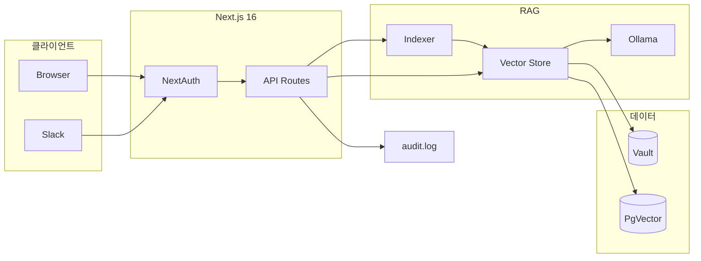
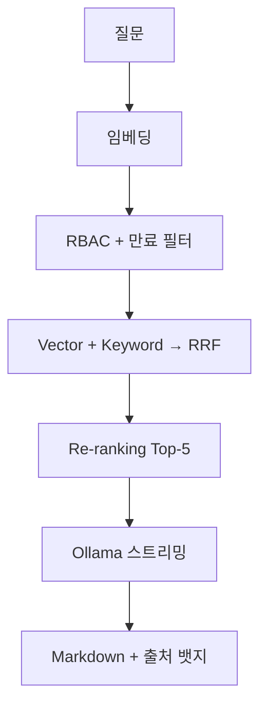

# CorpBrain

**NovaPay(노바페이)** 사내 지식 베이스를 위한 엔터프라이즈급 **로컬 RAG 챗봇**입니다.  
사내 문서를 Ollama로 로컬 처리하며, RBAC·NextAuth·Slack 연동까지 지원합니다.

> 타깃: 주식회사 노바페이 — B2B 결제·정산 FinTech (320명)  
> 상세 계획: [`docs/UPGRADE_PLAN.md`](docs/UPGRADE_PLAN.md)

---

## 주요 기능

| 영역 | 기능 |
|------|------|
| **검색** | Vector + Keyword 하이브리드 → RRF → Re-ranking 2차 정렬 |
| **청킹** | 마크다운 헤더 기반 Semantic Chunking, PDF/DOCX 길이 분할 |
| **권한** | Frontmatter RBAC + NextAuth 세션, 서버측 Pre-filtering |
| **인증** | Credentials 데모 + Google Workspace SSO (`@novapay.kr`) |
| **문서** | `.md` / `.pdf` / `.docx` 업로드, 증분 인덱싱 |
| **프라이버시** | Ollama + Transformers.js — 외부 API 키 불필요 |
| **관측** | 감사 로그, SIEM Webhook, Admin 대시보드, Hit@K/MRR |
| **연동** | Slack `/corpbrain`, Docker, GitHub Actions CI |

---

## 시스템 아키텍처

CorpBrain은 **브라우저·Slack**에서 들어온 요청을 NextAuth로 인증한 뒤, RAG 파이프라인으로 문서를 검색하고 Ollama가 답변을 생성합니다. 벡터 인덱스는 JSON(개발) 또는 PgVector(운영) 중 선택할 수 있습니다.



| 레이어 | 기술 |
|--------|------|
| Frontend | React 19, TailwindCSS 4, react-markdown |
| Auth | NextAuth v5, Middleware |
| AI | Vercel AI SDK v6, Ollama llama3, Transformers.js |
| Storage | JSON / PostgreSQL + PgVector, Markdown Vault |
| Ops | audit.log, SIEM Webhook, GitHub Actions, Docker |

---

## RAG 검색 파이프라인

질문이 들어오면 아래 순서로 처리됩니다. 그림으로 표현하기 어려운 **인증·RBAC·만료 필터**는 검색 직전에 한 번에 적용됩니다.



**1단계 — 후보 수집:** Cosine Similarity(의미)와 토큰 매칭(키워드) 각각 순위를 매기고, RRF(`k=60`)로 Top-20을 뽑습니다.

**2단계 — Re-ranking:** 파일명·제목·구문 일치 여부로 가산점을 주어 Top-5를 확정합니다. Admin 대시보드에서 Hit@3, MRR로 품질을 측정할 수 있습니다.

**3단계 — 생성:** Top-5 청크를 System Prompt에 넣고 Ollama가 스트리밍 응답을 만듭니다. `[출처: filename.md]` 형식으로 인용을 강제합니다.

---

## 인증 & RBAC

로그인은 **Credentials**(데모 계정) 또는 **Google SSO**(`@novapay.kr`만 허용) 두 가지입니다. 세션 JWT는 8시간 유지되며, Role은 UI가 아닌 **서버 세션**에서 읽습니다. API마다 `requireAuth()`로 검증하고, 검색 시 문서 `role` frontmatter로 Pre-filtering합니다.

| Role | 열람 문서 | 업로드 | Sync Vault | Admin |
|------|-----------|--------|------------|-------|
| `general` | general | — | — | — |
| `manager` | general + manager | O | — | — |
| `admin` | 전체 | O | O | O |

Google SSO로 처음 들어온 `@novapay.kr` 계정은 기본 `general`이며, 등록된 데모 계정은 DB Role을 그대로 씁니다.

---

## 문서 인덱싱

**지원 형식:** `.md`(frontmatter + 헤더 청킹), `.pdf`(pdf-parse), `.docx`(mammoth). PDF/DOCX는 `.meta.json` sidecar에 role·제목을 저장합니다.

**전체 재인덱싱:** Admin이 `Sync Vault` 실행 → Vault 내 모든 문서를 청킹·임베딩 → JSON 또는 PgVector에 일괄 저장.

**증분 인덱싱:** Manager+가 Upload UI로 파일 업로드 → 해당 파일만 `indexSingleFile()` → 즉시 검색 반영.

```yaml
---
role: manager
title: Q2 실적 보고서
expires: 2027-06-30   # 만료 후 검색 제외
---
```

---

## API 엔드포인트

| Method | Path | 권한 | 설명 |
|--------|------|------|------|
| `POST` | `/api/chat` | 로그인 | RAG 스트리밍 (20 req/min) |
| `POST` | `/api/upload` | manager+ | 업로드 + 증분 인덱싱 |
| `POST` | `/api/index` | admin | Vault 전체 재인덱싱 |
| `GET` | `/api/health` | 공개 | 헬스체크 |
| `POST` | `/api/slack/command` | Slack 서명 | `/corpbrain [질문]` |
| `GET` | `/api/admin/*` | admin | 감사 로그, 문서, 메트릭 |

---

## 프로젝트 구조

```
src/
├── app/          # page.tsx, login/, admin/, api/*
├── lib/
│   ├── indexer/      # 청킹, 증분/전체 인덱싱
│   ├── parsers/      # PDF, DOCX 추출
│   ├── vector-store/ # JSON / PgVector, hybridSearch
│   ├── search/       # reranker, Hit@K/MRR
│   ├── auth/           # NextAuth, Role 매핑
│   └── audit/          # 감사 로그, SIEM, 만료 검사
├── auth.ts, middleware.ts
e2e/                # Playwright E2E
data/               # eval-queries.json (검색 평가셋)
sample-docs/        # NovaPay 합성 문서 20종
docs/UPGRADE_PLAN.md
```

---

## 실행 방법

### 로컬 개발

```bash
git clone https://github.com/dayainow/corp-brain.git && cd corp-brain
cp .env.example .env.local   # AUTH_SECRET 설정
npm install
ollama run llama3            # 별도 터미널
npm run dev                  # http://localhost:3000
```

### Docker (PgVector)

```bash
docker compose up -d postgres && npm run db:init
VECTOR_STORE=pgvector npm run db:migrate
docker compose up app
```

### 테스트

```bash
npm test              # Vitest (20개)
npm run test:e2e      # Playwright (서버 실행 중)
npm run eval:search   # Hit@K, MRR 평가
```

---

## 데모 계정 (NovaPay)

| 이메일 | Role | 비밀번호 |
|--------|------|----------|
| kim.junho@novapay.kr | general | novapay2026 |
| park.suyeon@novapay.kr | manager | novapay2026 |
| lee.minho@novapay.kr | admin | novapay2026 |

---

## 환경 변수

필수: `AUTH_SECRET`, `AUTH_URL`, `VAULT_PATH`  
선택: `VECTOR_STORE`, `DATABASE_URL`, `GOOGLE_CLIENT_*`, `SLACK_SIGNING_SECRET`, `AUDIT_WEBHOOK_URL`

전체 목록 → [`.env.example`](.env.example)

---

## 로드맵

| Phase | 상태 | 내용 |
|-------|------|------|
| 1 PoC | 완료 | RRF 검색, RBAC, Ollama, sample-docs |
| 2 인증·영속화 | 완료 | NextAuth, PgVector, PDF/DOCX, 업로드 |
| 3 운영·품질 | 완료 | Re-ranking, E2E, CI/CD, Rate limit |
| 4 엔터프라이즈 | 완료 | Admin, Slack, SIEM, 문서 만료 |
| 5+ 향후 | 예정 | Cross-encoder, Teams, K8s, 2FA |

---

## 기여

이슈·PR: [dayainow/corp-brain](https://github.com/dayainow/corp-brain)  
상세 설계·다이어그램: [`docs/UPGRADE_PLAN.md`](docs/UPGRADE_PLAN.md)
