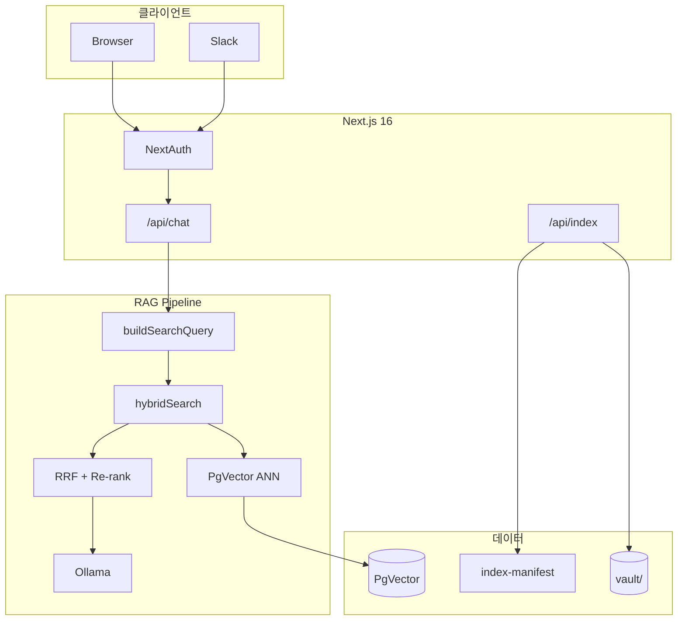

# CorpBrain 실무 도입 업그레이드 계획서

> **타깃 고객사**: 주식회사 노바페이 (NovaPay)  
> **문서 버전**: v2.0 · 2026-07-02  
> **현재 단계**: Phase 4.5 (파일럿 준비) 진행 중

---

## 1. 타깃 회사 프로필 — NovaPay (노바페이)

### 1.1 회사 개요

| 항목 | 내용 |
|------|------|
| **회사명** | 주식회사 노바페이 (NovaPay Co., Ltd.) |
| **업종** | B2B 결제·정산 FinTech SaaS |
| **규모** | 임직원 약 320명 |
| **주요 서비스** | 가맹점 결제 API, 자동 정산, 세금계산서 연동 |

### 1.2 도입 배경

사내 문서(인사·재무·법무)가 급증하면서 Notion/Confluence 검색의 **권한 분리 한계**와 ChatGPT의 **기밀 유출 리스크**가 문제입니다. CorpBrain은 **로컬 Ollama + RBAC RAG**로 이를 해결합니다.

### 1.3 RBAC 매핑

| Role | 대상 | 열람 예시 |
|------|------|-----------|
| `general` | 일반 직원 | 휴가 규정, 재택 정책, 온보딩 |
| `manager` | 팀장 | + 분기 보고서, AWS 인보이스, 장애 메모 |
| `admin` | 법무·CSO | + NDA, 계약서 |

### 1.4 초기 배포 계정

비밀번호 공통: `novapay2026` — `lee.minho@novapay.kr` (admin) 등 5종. 상세: `src/lib/auth/users.ts`

---

## 2. 현재 상태 (2026-07-02)

| 영역 | 상태 |
|------|------|
| 인증 | ✅ NextAuth v5 Credentials + Google SSO (`@novapay.kr`) |
| RBAC | ✅ 세션 기반 API Guard, 업로드 role 검증 |
| 문서 Vault | ✅ `vault/` 부서·권한별 22종 + `uploads/` |
| 벡터 DB | ✅ JSON(개발) / PgVector(운영), **ANN 검색** |
| RAG | ✅ Hybrid RRF + Re-rank, **멀티턴 쿼리**, 한국어 임베딩 |
| 인덱싱 | ✅ 전체 Sync + **증분 Sync** (mtime/hash manifest) |
| UI | ✅ Markdown + 출처, 가이드(`/guide`), 도움말 패널 |
| Admin | ✅ 감사 로그, 문서 통계, Hit@3/MRR |
| 보안 | ✅ Rate limit, SIEM Webhook, 문서 만료 |
| 연동 | ✅ Slack `/corpbrain` |
| 품질 | ✅ Vitest 37+, E2E 9, **5팀 Quality Harness**, eval CI |
| 배포 | ✅ Docker Compose, GitHub Actions |

---

## 3. 단계별 로드맵

### Phase 1 — RAG PoC ✅

- [x] Hybrid 검색 (Vector + Keyword + RRF)
- [x] Semantic Chunking, Frontmatter RBAC
- [x] Ollama 스트리밍, 출처 뱃지

### Phase 2 — 인증·영속화 ✅

- [x] NextAuth, 시드 계정 5종, Google SSO
- [x] VectorStore 추상화, PgVector, 증분 업로드 인덱싱
- [x] PDF/DOCX 파싱

### Phase 3 — 운영·품질 ✅

- [x] Re-ranking, Hit@K/MRR, `eval-queries.json`
- [x] Playwright E2E, GitHub Actions CI
- [x] Rate limiting, `/api/health`
- [x] Quality Harness (5팀) + `quality:loop`

### Phase 4 — 엔터프라이즈 ✅

- [x] Admin 대시보드, 감사 로그 + SIEM
- [x] Slack Slash Command, 문서 만료 정책
- [x] Docker standalone, 보안 헤더

### Phase 4.5 — 파일럿 준비 🔄 (현재)

- [x] `sample-docs` → `vault/` 납품 구조
- [x] 채팅 UIMessage 안정화, 한국어 프롬프트
- [x] `multilingual-e5-small` 임베딩
- [x] PgVector ANN + SQL 키워드 후보 검색
- [x] 증분 Sync (`data/index-manifest.json`)
- [x] eval CI 게이트 (Hit@3 ≥ 80%)
- [x] 문서 트리 검색 + 출처 원문 보기
- [x] Compose 운영 스모크 (`npm run smoke:compose`)
- [x] E2E 22건 (RBAC·트리·원문)
- [ ] 파일럿 50명 배포 (운영 오픈)
- [x] 채팅 👍/👎 피드백 → audit.log
- [x] Slack Role 매핑 + Ollama 답변 생성
- [x] 한국어 쿼리 정규화·동의어 리랭킹
- [x] `ko-sroberta` 임베딩 A/B 테스트 (`npm run eval:embedding-ab`)

### Phase 5 — 확장 (향후)

- [ ] Notion/Confluence/Drive 커넥터 (Glean 패턴)
- [ ] Cross-encoder Re-ranking
- [x] Slack 사용자별 Role + LLM 답변
- [x] 채팅 피드백(👍/👎) → 검색 품질 루프
- [ ] Microsoft Teams 봇
- [ ] K8s, 2FA TOTP, 멀티 테넌트

---

## 4. 기술 아키텍처



---

## 5. 품질 하네스 (5팀)

| 팀 | 담당 | 실행 |
|----|------|------|
| 플랫폼 | Health, Vault | `npm run harness:quality` |
| 검색품질 | Hit@3, 멀티턴 쿼리 | `npm run eval:search` |
| 보안 | RBAC, Rate limit | `src/lib/rbac.test.ts` |
| RAG | 메시지·임베딩 | `messages.test.ts` |
| 납품 | E2E, 빌드 | `npm run quality:loop` |

구현: `.ax/harnesses/` · 에이전트 규칙: `AGENTS.md`

---

## 6. KPI (파일럿 목표)

| KPI | 목표 | 현재 측정 |
|-----|------|-----------|
| Hit@3 | ≥ 80% | `npm run eval:search` (CI: ≥50%) |
| P50 응답 | ≤ 5초 | audit.log / APM |
| RBAC 위반 | 0% | harness + rbac.test |
| DAU | 30명+ | audit.log |
| 문서 | 200건+ | vault + uploads |

---

## 7. 즉시 실행 체크리스트

```bash
cp .env.example .env.local
# VAULT_PATH=./vault, AUTH_SECRET 설정

ollama run llama3
npm run dev

# Admin 로그인 → Sync Vault
# lee.minho@novapay.kr / novapay2026

# 증분 동기화 (변경분만)
curl -X POST http://localhost:3000/api/index \
  -H "Cookie: ..." -d '{"mode":"incremental"}'

# 품질 루프
npm run quality:loop
```

---

## 8. 주요 파일 구조

```
corp-brain/
├── vault/                    # 사내 문서 Vault
├── .ax/harnesses/            # 5팀 품질 하네스
├── src/
│   ├── app/api/chat/         # RAG 스트리밍
│   ├── app/api/index/        # full / incremental sync
│   ├── lib/
│   │   ├── vector-store/     # JSON + PgVector ANN
│   │   ├── search/           # hybrid-core, query-context, reranker
│   │   ├── indexer/          # manifest, runIncrementalSync
│   │   └── auth/             # users, guard, role-mapping
│   └── components/           # chat, guide, upload
├── data/eval-queries.json
├── e2e/
└── docs/UPGRADE_PLAN.md
```

---

*이 문서는 CorpBrain 고도화 진행에 따라 지속 업데이트됩니다.*
