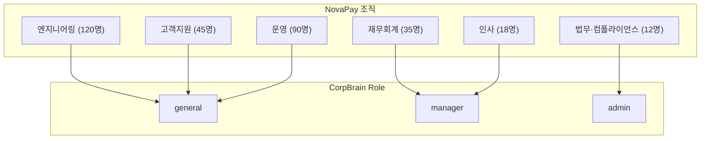
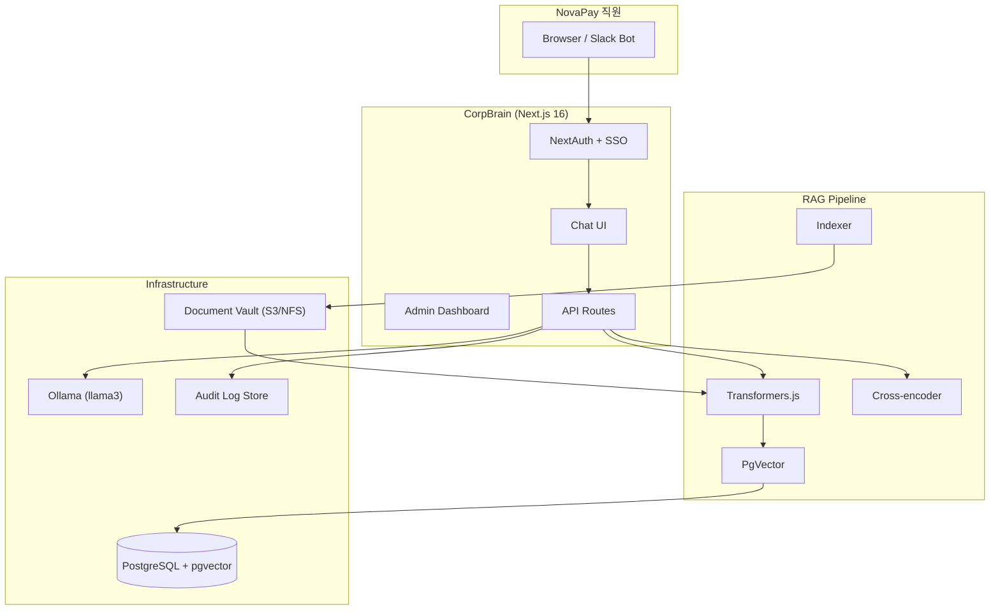

# CorpBrain 실무 도입 업그레이드 계획서

> **타깃 고객사**: 주식회사 노바페이 (NovaPay)  
> **문서 버전**: v1.0 · 2026-07-01  
> **현재 단계**: Phase 4 완료

---

## 1. 타깃 회사 프로필 — NovaPay (노바페이)

### 1.1 회사 개요

| 항목 | 내용 |
|------|------|
| **회사명** | 주식회사 노바페이 (NovaPay Co., Ltd.) |
| **업종** | B2B 결제·정산 FinTech SaaS |
| **설립** | 2019년 |
| **규모** | 임직원 약 320명 (Series B, 누적 투자 450억) |
| **본사** | 서울 강남구 |
| **주요 서비스** | 가맹점 결제 API, 자동 정산, 세금계산서 연동, 가맹점 대시보드 |
| **고객** | 온라인 커머스, 프랜차이즈, 마켓플레이스 약 2,400개 가맹점 |

### 1.2 도입 배경

노바페이는 빠른 성장으로 **사내 문서가 폭발적으로 증가**했습니다.

- 인사·복지 규정, 재택·출장 정책 (전 직원 열람)
- 분기 실적 보고서, AWS 청구서, 장애 대응 메모 (팀장 이상)
- NDA, 임대차·벤더 계약서 (법무/CSO만)

기존 Notion/Confluence 검색은 **권한 분리가 약하고**, ChatGPT 사용은 **기밀 유출 리스크**가 있어 CorpBrain PoC를 도입합니다.

### 1.3 조직 및 RBAC 매핑



| Role | 대상 직군 | 열람 문서 예시 |
|------|-----------|----------------|
| `general` | 일반 직원 | 휴가 규정, 출장 정책, 온보딩 메모, 기획 제안서 |
| `manager` | 팀장·리드 | + 분기 보고서, AWS 인보이스, 장애 메모 |
| `admin` | CSO, 법무, C-level | + NDA, 계약서, 임대차 agreement |

### 1.4 데모 계정

| 이름 | 이메일 | 부서 | Role | 비밀번호 |
|------|--------|------|------|----------|
| 김준호 | kim.junho@novapay.kr | 엔지니어링 | general | novapay2026 |
| 정해인 | jung.haein@novapay.kr | 고객지원 | general | novapay2026 |
| 박수연 | park.suyeon@novapay.kr | 재무회계 | manager | novapay2026 |
| 최유나 | choi.yuna@novapay.kr | 인사 | manager | novapay2026 |
| 이민호 | lee.minho@novapay.kr | 법무·컴플라이언스 | admin | novapay2026 |

---

## 2. 현재 상태 (As-Is) vs 목표 (To-Be)

| 영역 | PoC (Phase 1) | 실무 목표 (Phase 4) | 현재 (Phase 2A) |
|------|---------------|---------------------|-----------------|
| 인증 | UI 드롭다운 Role | SSO + NextAuth + JWT | ✅ NextAuth Credentials |
| RBAC | 쿼리 파라미터 | 서버 세션 기반 | ✅ API Guard |
| 벡터 DB | vectors.json | PgVector | ✅ 추상화 + PgVector 구현 |
| 문서 관리 | sample-docs 고정 | 업로드 + 버전관리 | ✅ Upload API |
| 응답 UI | Plain text | Markdown + 출처 | ✅ react-markdown |
| 감사 | 없음 | 접근 로그 | ✅ audit.log |
| 배포 | 로컬 only | Docker + CI/CD | ✅ Docker + GitHub Actions |
| 관측성 | console.log | 메트릭 + 대시보드 | ✅ Admin 대시보드 + Health API |

---

## 3. 단계별 로드맵

### Phase 2A — 인증·보안·UX 기반 ✅ (현재)

- [x] NextAuth.js v5 Credentials Provider
- [x] NovaPay 데모 계정 5종
- [x] Middleware 라우트 보호
- [x] API 서버측 Role 검증 (`requireAuth`)
- [x] 문서 업로드 API (Manager+)
- [x] Sync Vault Admin 전용
- [x] react-markdown + GFM 응답 렌더링
- [x] 감사 로그 (`data/audit.log`)
- [x] `.env.example` + `lib/config.ts` 중앙 설정
- [x] 업그레이드 계획서 (본 문서)

### Phase 2B — 데이터 영속화 ✅

- [x] PgVector + PostgreSQL (`docker-compose.yml`)
- [x] Vector Store 추상화 레이어 (`VectorStore` interface)
- [x] `vectors.json` → PgVector 마이그레이션 스크립트
- [x] 업로드 후 자동 증분 인덱싱
- [x] 문서 메타데이터 테이블 (제목, 작성자, 업로더)

**예상 기간**: 1~2주  
**완료 기준**: 10만 청크 이하 500ms 이내 검색, 서버 재시작 후에도 인덱스 유지

### Phase 2C — IdP 연동 ✅

- [x] Google Workspace OAuth Provider (조건부 활성화)
- [x] @novapay.kr 도메인 제한
- [x] 이메일·부서 → Role 자동 매핑
- [x] 세션 타임아웃 8시간

**예상 기간**: 1주  
**완료 기준**: 노바페이 Google Workspace 계정으로 로그인, Role 자동 부여

### Phase 3 — 운영·품질 ✅

- [x] Docker Compose (App + Postgres)
- [x] GitHub Actions CI (lint, build, unit test)
- [x] Vitest: RBAC, SSO Role 매핑 단위 테스트
- [ ] Playwright E2E (향후)
- [ ] Cross-encoder Re-ranking (향후)
- [ ] 검색 품질 메트릭 (향후)
- [x] Rate limiting (채팅 API 20req/min)
- [x] 헬스체크 `/api/health`

**예상 기간**: 2주  
**완료 기준**: CI green, 단위 테스트 10개 통과

### Phase 4 — 엔터프라이즈 (파일럿) ✅

- [x] Docker 프로덕션 빌드 (standalone)
- [ ] 멀티 테넌트 (향후)
- [ ] 감사 로그 → SIEM 연동 (향후)
- [ ] 문서 만료·보존 정책 (향후)
- [ ] PDF/DOCX 파싱 (향후)
- [ ] 슬랙봇 / Teams 봇 연동 (향후)
- [x] 관리자 대시보드 (`/admin` — 감사로그, 문서 목록, 통계)

**예상 기간**: 4~6주  
**완료 기준**: 노바페이 파일럿 50명, 주 500건 질의, P95 응답 8초 이내

---

## 4. 기술 아키텍처 (목표)



---

## 5. NovaPay 파일럿 성공 지표 (KPI)

| KPI | 목표 | 측정 방법 |
|-----|------|-----------|
| 검색 정확도 (Hit@3) | ≥ 80% | 샘플 50문항 평가셋 |
| 평균 응답 시간 | ≤ 5초 | API latency P50 |
| 권한 위반 차단율 | 100% | RBAC 테스트 케이스 |
| 일간 활성 사용자 | 30명+ | audit.log 집계 |
| 문서 커버리지 | 200건+ | Vault 인덱싱 수 |
| 사용자 만족도 | NPS ≥ 40 | 파일럿 종료 설문 |

---

## 6. 리스크 및 대응

| 리스크 | 영향 | 대응 |
|--------|------|------|
| Ollama 응답 품질 부족 | 높음 | llama3.1 / qwen2.5 교체, 프롬프트 튜닝 |
| vectors.json 확장 한계 | 높음 | Phase 2B PgVector 우선 착수 |
| SSO 연동 지연 | 중간 | Credentials로 파일럿, OAuth 병행 |
| 기밀 문서 유출 | 치명적 | RBAC + 감사로그 + 온프레미스 배포 |
| 임베딩 모델 한국어 약점 | 중간 | `ko-sroberta` 등 한국어 모델 검토 |

---

## 7. 즉시 실행 체크리스트

```bash
# 1. 환경 설정
cp .env.example .env.local
# AUTH_SECRET 생성: openssl rand -base64 32

# 2. Ollama 실행
ollama run llama3

# 3. 개발 서버
npm run dev

# 4. 로그인 (Admin)
# lee.minho@novapay.kr / novapay2026

# 5. Sync Vault → 채팅 테스트
```

---

## 8. 파일 구조 (Phase 2A 이후)

```
src/
├── auth.ts                    # NextAuth 설정
├── middleware.ts              # 라우트 보호
├── app/
│   ├── login/page.tsx         # 로그인
│   ├── page.tsx               # 채팅 UI
│   └── api/
│       ├── auth/[...nextauth]/
│       ├── chat/route.ts      # RAG (인증 필수)
│       ├── index/route.ts     # 인덱싱 (Admin)
│       └── upload/route.ts    # 업로드 (Manager+)
├── components/
│   ├── chat-message.tsx       # Markdown 렌더링
│   ├── document-upload.tsx    # 업로드 모달
│   └── providers.tsx          # SessionProvider
└── lib/
    ├── config.ts              # 환경 설정
    ├── rbac.ts                # 권한 유틸
    ├── auth/
    │   ├── users.ts           # NovaPay 계정
    │   └── guard.ts           # API 인증 가드
    └── audit/index.ts         # 감사 로그
```

---

*이 문서는 CorpBrain 고도화 진행에 따라 지속 업데이트됩니다.*
