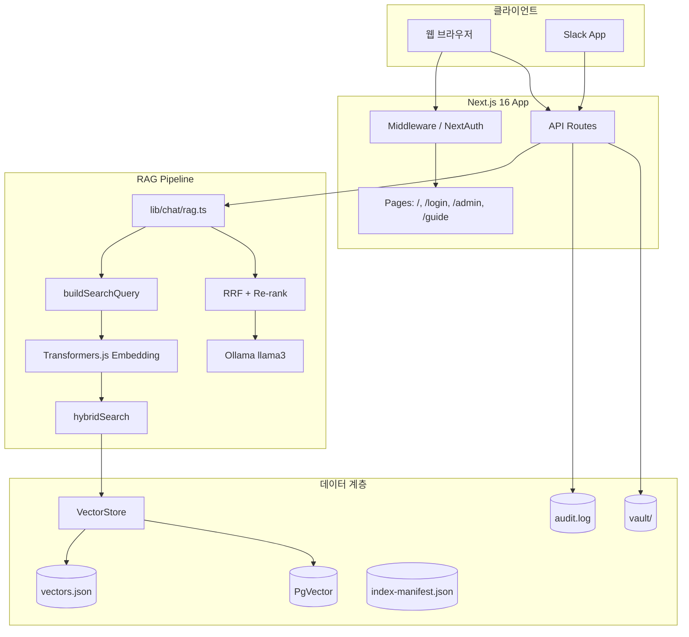

# 03. 시스템 아키텍처 설계서

| 항목 | 내용 |
|------|------|
| 프로젝트명 | CorpBrain |
| 문서 버전 | v1.1 |
| 작성일 | 2026-07-03 |

---

## 1. 아키텍처 개요

CorpBrain은 Next.js 16 기반 풀스택 RAG 애플리케이션으로, **인증 → 검색 → LLM 스트리밍** 파이프라인을 단일 서버에서 처리합니다. 외부 LLM API 없이 Ollama·Transformers.js로 로컬 추론·임베딩을 수행합니다.

---

## 2. 시스템 구성도

---

## 3. 기술 스택

| 레이어 | 기술 | 버전(대표) |
|--------|------|------------|
| Frontend | React, TailwindCSS | 19, 4 |
| Framework | Next.js (App Router) | 16.2 |
| Auth | NextAuth v5, bcryptjs | beta.31 |
| AI SDK | Vercel AI SDK | v6 |
| LLM | Ollama (OpenAI 호환 API) | llama3 |
| Embedding | @xenova/transformers | multilingual-e5-small |
| Vector DB | JSON / PostgreSQL + pgvector | — |
| DB Client | pg | 8.x |
| Parsing | pdf-parse, mammoth | PDF/DOCX |
| Test | Vitest, Playwright | 4.x, 1.61 |
| Container | Docker Compose | postgres + app |

---

## 4. 레이어별 책임

### 4.1 Presentation (`src/app`, `src/components`)

- 채팅 UI, 로그인, Admin, 가이드
- `useChat` + `DefaultChatTransport` 스트리밍

### 4.2 API (`src/app/api`)

- 인증 가드 (`requireAuth`)
- RAG, 인덱싱, 업로드, Admin, Health, Slack

### 4.3 Domain (`src/lib`)

| 모듈 | 책임 |
|------|------|
| `auth/` | 사용자, SSO Role, Slack 매핑 |
| `rbac.ts` | Role 계층·권한 판단 |
| `chat/` | 메시지 변환, RAG 공통 |
| `search/` | hybrid-core, reranker, query-context, korean-query |
| `vector-store/` | JSON/PgVector, hybridSearch |
| `indexer/` | 청킹, 전체/증분 인덱싱, manifest |
| `embeddings/` | Transformers.js 싱글톤 |
| `audit/` | 감사 로그, SIEM |

### 4.4 Infrastructure

- `middleware.ts` — 라우트 보호
- `instrumentation.ts` — 프로덕션 env 검증
- `docker-compose.yml` — Postgres + App

---

## 5. 데이터 흐름 (채팅)

1. 사용자 메시지 → `POST /api/chat`
2. `buildSearchQuery` — 멀티턴 맥락 결합
3. `generateEmbedding` — 384차원 벡터
4. `hybridSearch` — RBAC 필터 → RRF → Re-rank → Top-K
5. `buildSystemPrompt` — Context 주입
6. `createUIMessageStream` — `data-rag-status` (searching → generating), `data-rag-sources`
7. `streamText` → Ollama → UI 스트리밍 (`text-delta`)
8. `writeAuditLog` — 질의·출처 기록

---

## 6. 배포 아키텍처

| 환경 | Vector Store | Vault | LLM |
|------|--------------|-------|-----|
| 로컬 개발 | JSON | `./vault` | Ollama localhost |
| Docker | PgVector | volume mount | Ollama (외부/동일 호스트) |
| 운영(권장) | PgVector | NFS/S3 sync | 전용 Ollama 서버 |

---

## 7. 보안 아키텍처

- **인증**: JWT 세션 (NextAuth)
- **인가**: API `requireAuth(minRole)` + 검색 단계 RBAC Pre-filter
- **감사**: 모든 chat/upload/index → audit.log
- **Rate limit**: 인메모리 (운영 시 Redis 확장 권장)
- **Slack**: HMAC 서명 검증 + replay 방어

---

## 8. 변경 이력

| 버전 | 일자 | 변경 내용 |
|------|------|-----------|
| v1.0 | 2026-07-02 | 최초 작성 |
| v1.1 | 2026-07-03 | UIMessage data parts 스트리밍, PgVector·Redis 운영 |
