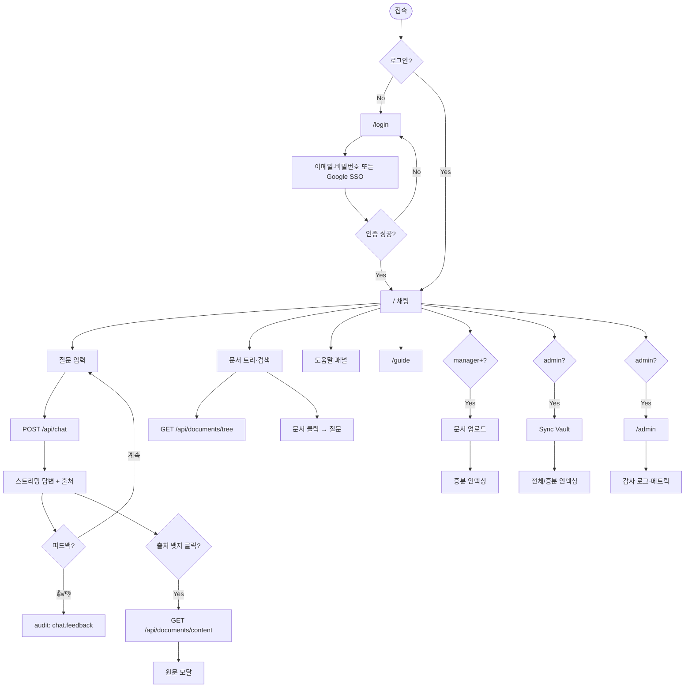
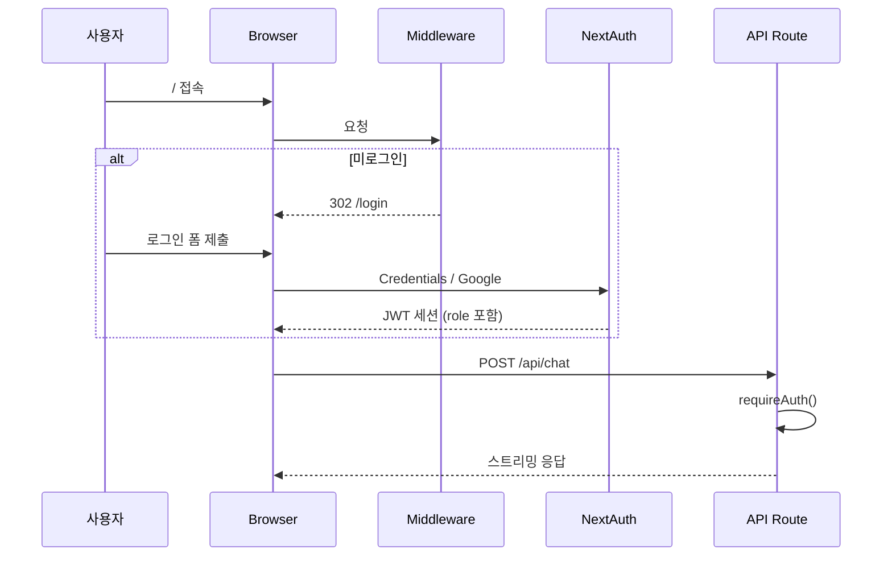
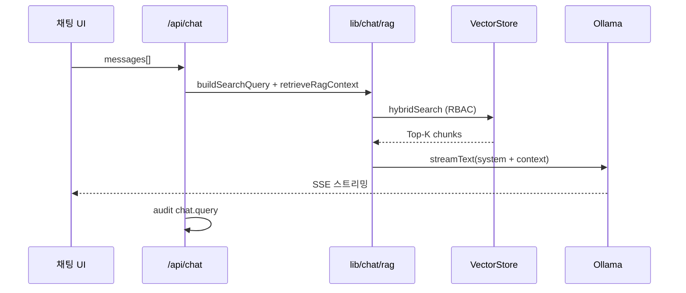
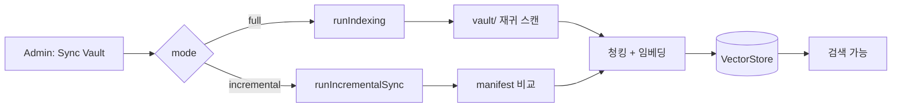
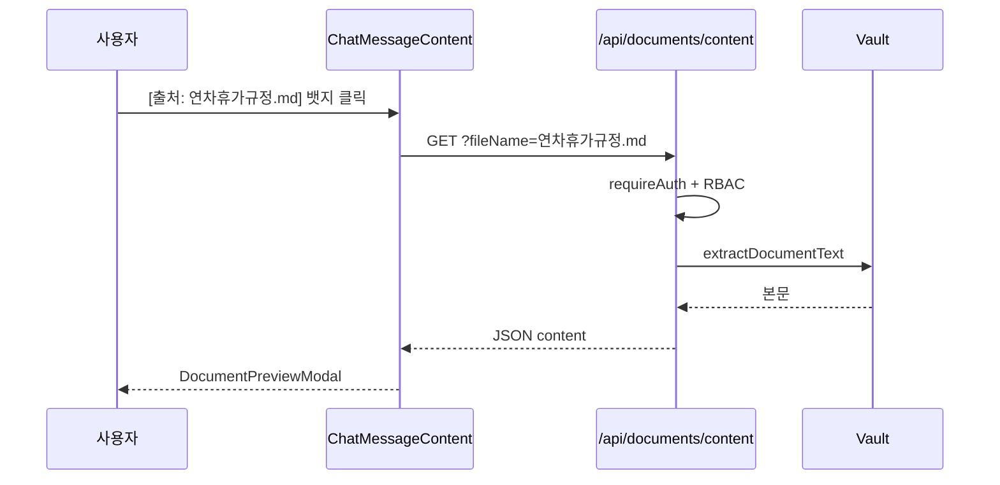

# 04. 화면 흐름도

| 항목 | 내용 |
|------|------|
| 프로젝트명 | CorpBrain |
| 문서 버전 | v1.1 |
| 작성일 | 2026-07-03 |

---

## 1. 전체 사용자 흐름

---

## 2. 인증 흐름

---

## 3. RAG 질의 흐름

---

## 4. 문서 인덱싱 흐름

---

## 6. 출처 원문 조회 흐름

---

## 7. Role별 화면 접근

| Role | /login | / | /guide | /admin | Upload | Sync |
|------|--------|---|--------|--------|--------|------|
| general | O | O | O | X | X | X |
| manager | O | O | O | X | O | X |
| admin | O | O | O | O | O | O |

---

## 6. 변경 이력

| 버전 | 일자 | 변경 내용 |
|------|------|-----------|
| v1.0 | 2026-07-02 | 최초 작성 |
| v1.1 | 2026-07-03 | 문서 트리·출처 원문 흐름 추가 |
